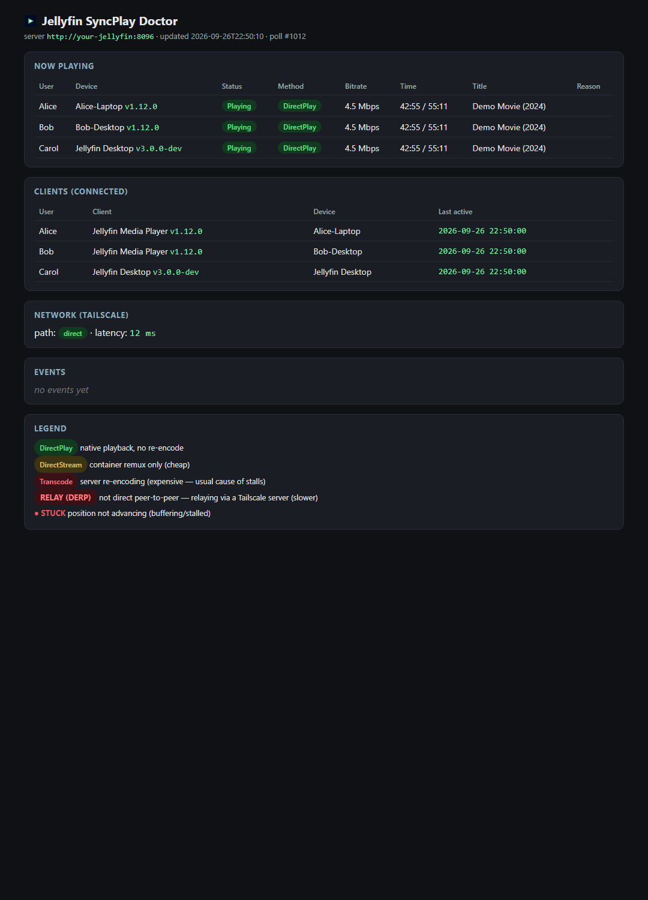
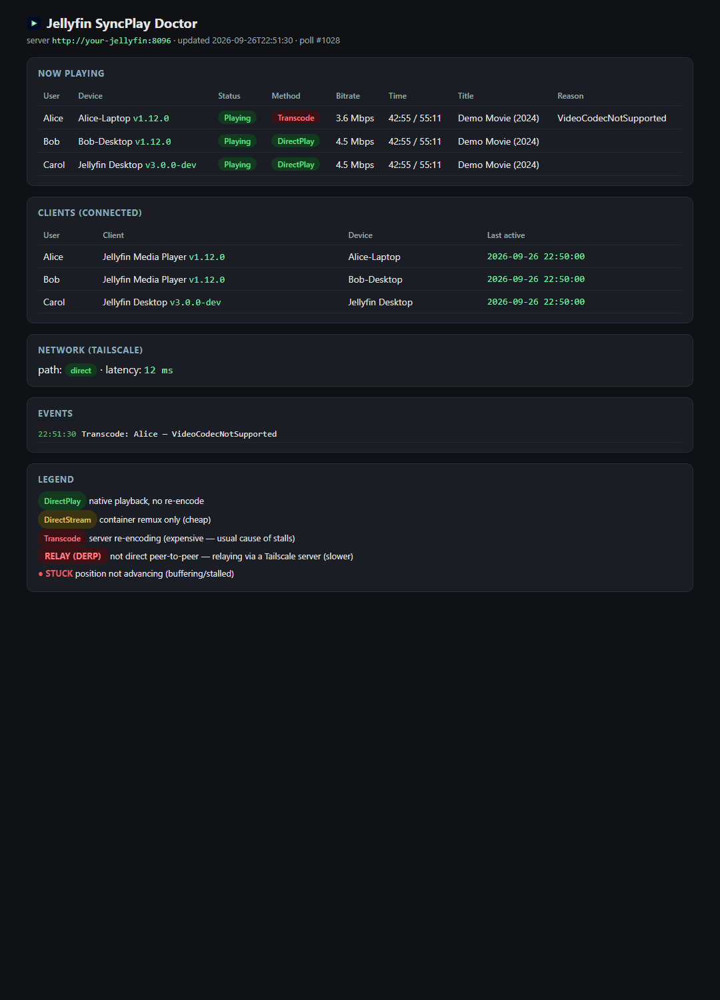
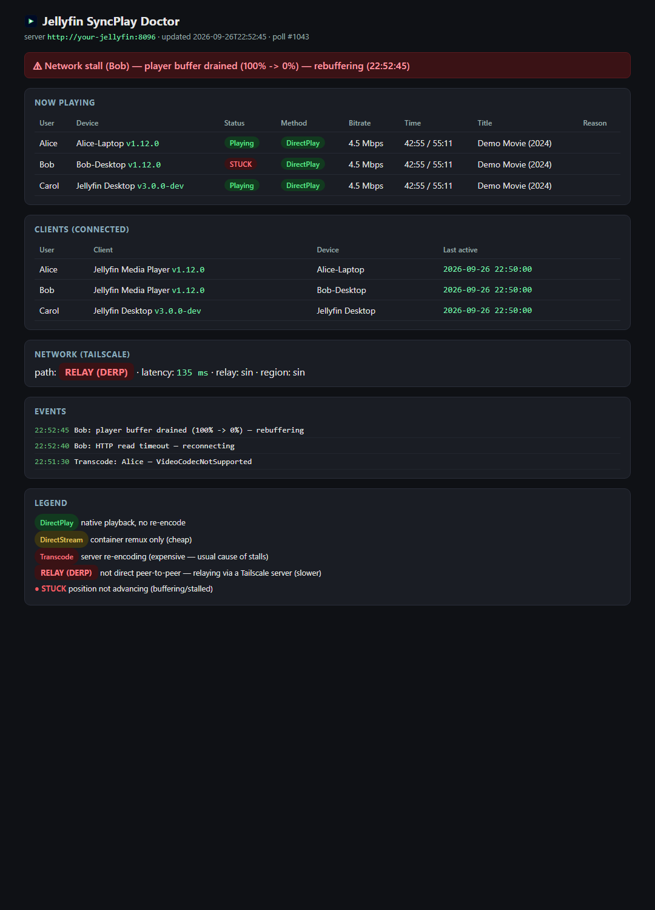

# Jellyfin SyncPlay Doctor

Diagnose the "one person stuck at loading" problem in a multi-person Jellyfin
SyncPlay watch party — especially over Tailscale.

It polls the Jellyfin **`/Sessions`** API and shows, for every viewer in real
time, whether their stream is **DirectPlay**, **DirectStream**, or **Transcode**,
at what bitrate, with what transcode reason, their **Playing / Paused / STUCK**
status, and their exact position. It also captures the Tailscale network
path/latency and tails the viewer's client log for stall signatures.

<p align="center">
  
  
  
</p>

## Why a stuck viewer is usually *not* a SyncPlay bug

SyncPlay only synchronizes playback **position** — every viewer still pulls their
own stream from the server. So "one person is stuck" usually comes down to one of:

- **Transcoding** — a client forcing the server to re-encode (codec, subtitle
  burn-in, or a quality/bitrate cap). The most common cause of stalls.
- **Network** — a slow or relayed Tailscale link (DERP relay instead of direct
  peer-to-peer).
- **Client mismatch** — e.g. the Electron "Jellyfin Desktop" vs the MPV-based
  "Jellyfin Media Player".
- **Group sync** — SyncPlay pausing / seek-correcting the whole group.

For each viewer it records the play method, status, bitrate, transcode reason,
network path, and stall events — so you can see **who** and **why** in one glance.

## How it works

Three small Python files, standard library only (no `pip install` needed):

| File | Role |
|---|---|
| `controller.py` | Always-on local HTTP server + dashboard (a Progressive Web App). Manages the recorder's start/stop and serves on `http://127.0.0.1:8124/` (auto-increments the port if taken). |
| `jellyfin_telemetry.py` | The recorder: polls `/Sessions`, writes `state.json` plus CSV/JSON logs. Run headless by the controller. |
| `launch.py` | Launcher: opens the running dashboard, or starts the controller if it isn't running. |

## Requirements

- **Python 3.8+** (no third-party packages).
- A Jellyfin **API key** (Dashboard → API Keys).
- *Optional:* the **Tailscale CLI** (`tailscale`) for network path/latency.

The core is fully cross-platform (Windows/macOS/Linux). The `.cmd` launchers and
the Start Menu installer are Windows-only conveniences.

## Setup (first time)

1. Copy the config template and fill in your server URL + API key:

   ```bash
   cp telemetry.config.example.json telemetry.config.json
   ```

   ```json
   {
     "serverUrl": "http://your-jellyfin-host:8096",
     "apiKey": "PASTE_YOUR_KEY_HERE",
     "githubRepo": "yourname/jellyfin-syncplay-doctor",
     "clientLogPath": ""
   }
   ```

   `telemetry.config.json` is git-ignored, so your key stays local.

2. **Or** skip the file and paste the key in the dashboard's **⚙ Settings** — the
   server URL, API key, GitHub repo, and client-log path are all editable in-app
   (the API key has a show/hide 👁 toggle).

> You can also set the key via the `JELLYFIN_API_KEY` environment variable.

## Quick start

Start it before your watch party.

**Windows:** double-click **`Start-Dashboard.cmd`** (or add it to the Start Menu —
see below). It opens the dashboard and, on first run, starts the controller +
recorder. Repeat launches just re-open the running dashboard.

**macOS / Linux:**

```bash
python launch.py          # open dashboard, starting the controller if needed
```

Or run the controller directly:

```bash
python controller.py
```

Then browse to the printed URL (default `http://127.0.0.1:8124/`).

To stop recording, click **Stop** in the dashboard (top-right). To stop the whole
server, close its console window / press `Ctrl+C`.

### Start Menu shortcut (Windows, optional)

```powershell
pwsh -NoProfile -File .\Add-StartMenuShortcut.ps1
```

Then press **Win**, type "Jellyfin SyncPlay", and (optionally) right-click →
**Pin to Start**.

## The dashboard

- **Now playing** — per-viewer play method, bitrate, position, transcode reason, STUCK badge.
- **Clients** — who's connected, which client + device, last active.
- **Network (Tailscale)** — direct vs DERP relay, region, latency.
- **Events** — a rolling log (transcode starts, buffer drains, HTTP reconnects, …).
- **Start / Stop** — control the recorder. Start is always available and idempotent
  (if it's already running, it just reconnects).
- **⚙ Settings** — server URL, API key (👁 reveal), GitHub repo (update checks),
  client-log path, and one-click **Open** buttons for the config/log/output files.
- Version badge (top-left) and an update banner when a newer GitHub release exists.

## Output (under `telemetry-py/`)

| File | Contents |
|---|---|
| `state.json` | latest snapshot served to the dashboard |
| `sessions.jsonl` | compact activity log — one entry per poll *while someone is playing* |
| `sessions.csv` | one row per viewer per poll — open in Excel |
| `tailscale.csv` | network path (`direct` vs `relay`), DERP region, latency |
| `client.log` | relevant lines tailed from Jellyfin Media Player's debug log |
| `recorder.pid` / `port.txt` | runtime state for the launcher/stop scripts |

## Reading the result

- `playMethod` — `DirectPlay`/`DirectStream` = cheap, no re-encode; `Transcode` =
  the server is re-encoding (expensive; the usual cause of one person stalling).
- `transcodeReason` — e.g. subtitle burn-in, codec/container, or bitrate limit.
- `stuck` — flagged when a non-paused session's position hasn't moved for 3+ polls.
- `tailscale.csv` `directOrRelay=relay` — that viewer's traffic is going through a
  DERP relay instead of peer-to-peer (slower; a common "one person can't load" cause).

## Development

`make_assets.py` regenerates the icon and demo screenshots (needs **Pillow** and a
Chromium/Edge binary). The generated assets are committed, so you only need to run
it if you change the branding.

### Releasing

Releases are fully automated — bump `APP_VERSION` in `controller.py`, commit, and
push to `master`. The workflow at `.github/workflows/release.yml` validates the
sources, then creates the `v<version>` tag and a GitHub release (with generated
notes) automatically.

## License

MIT — see [LICENSE](LICENSE).
